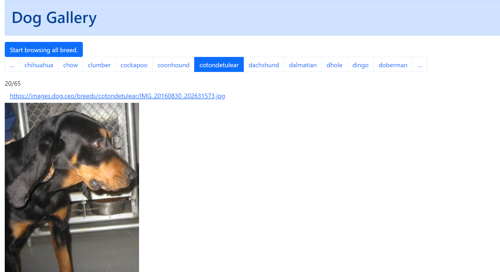

# async_workflow_on_xstate

## Purpose
With the help of the Finite State Machine function of XSTATE library, implement a small dog gallery to display one dog per breed iteratively.

## install

```
npm install
```

## run 

```
npm run dev
```

## browse

goto 
http://localhost:3005/

then click "start ..." button.

## snapshot

